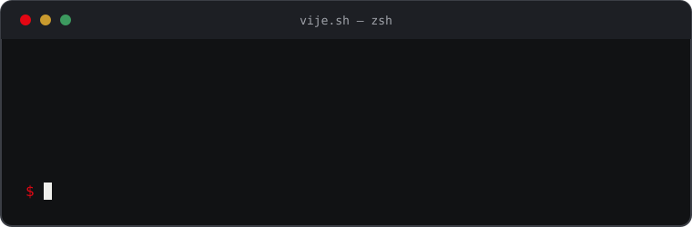

<div align="center">

<picture>
  <source media="(prefers-color-scheme: dark)" srcset="docs/assets/banner-dark.svg">
  
</picture>

<br>

[](https://vije.sh)
[](https://nextjs.org)
[](https://react.dev)
[](https://tailwindcss.com)
[](https://supabase.com)
[](https://vercel.com)
[](LICENSE)

**My personal site, blog and forum, designed as the datasheet of a chip.**

[Visit the site](https://vije.sh) · [Architecture](docs/application.md) · [Design](docs/design.md) · [Database](docs/database.md) · [Contributing](AGENTS.md)

</div>


## The idea

Most personal sites are a list of links. This one is a **datasheet**: a single part, **VKG-04**, with a pinout, a feature table, a running head and foot on every page, and a UART console that logs what the site is doing. The aesthetic is cream paper, ink black and one signal red.

The design is documented as **V18.1.1 "Datasheet, usable"**. See [`docs/design.md`](docs/design.md) for tokens, components and what has been ported from the original prototype.

## Pages

| Code | Page | What it is |
| :--: | --- | --- |
| **P1** | [Overview](https://vije.sh) | The datasheet: features, cluster, live telemetry |
| **P2** | [Work](https://vije.sh/work) | Deployments, the rack and career timing |
| **P3** | [Lab](https://vije.sh/lab) | How much memory a model needs |
| **P4** | [Photo](https://vije.sh/photo) | Rockets, roads, racks and one dog |
| **P5** | [Blog](https://vije.sh/blog) | Application notes, newest first |
| **P6** | [Forum](https://vije.sh/forum) | The community bus |
| **P7** | [Live](https://vije.sh/live) | Public data feeds: space, Earth, dev, AI |

## Highlights

- **Self-fitting header.** It measures itself and moves from full labels to dense spacing to a labelled menu button. No breakpoints, so it holds at any width, zoom or font.
- **Animated chip pinout.** Traces draw in, data packets travel along them, and the chip tilts toward the pointer on devices that support it.
- **19 live feeds** from free public APIs, grouped into Space, Earth, Dev, AI and Ops. Responses are cached on the server, so one upstream request serves every visitor and rate limits hold. Any feed can be pinned to the overview.
- **Interactive globe** that tracks the ISS and plots launches and earthquakes.
- **Git-based blog.** Posts live in [`content/blog`](content/blog) as plain files.
- **Light by default, dark on request.** The theme never follows the OS, and it is applied before first paint.
- **Tested.** Unit, component, integration and Playwright end-to-end tests, with axe accessibility checks on a production build.

## Stack

| Layer | Choice |
| --- | --- |
| Framework | Next.js 16 (App Router, Cache Components), React 19 |
| Styling | Tailwind v4 on top of CSS-variable design tokens, CSS Modules |
| Fonts | Space Grotesk and JetBrains Mono, self-hosted by `next/font` |
| Data | Supabase Postgres and Auth |
| Hosting | Vercel, with DNS on Cloudflare |
| Quality | TypeScript, ESLint, Prettier, Vitest, Playwright, axe |

## Quick start



```bash
git clone https://github.com/vijeshgowda/vije.sh
cd vije.sh
npm install
cp .env.example .env.local   # nothing is required to run the static site and live feeds
npm run dev                  # http://localhost:3000
```

### Scripts

| Command | What it does |
| --- | --- |
| `npm run dev` | Dev server (copies blog assets first) |
| `npm run build` / `npm start` | Production build and server |
| `npm run check` | Lint, types, format check, unit and component tests |
| `npm test` | Unit and component tests |
| `npm run test:int` | Integration tests (needs a local Postgres, see below) |
| `npm run test:e2e` | Playwright and axe on a production build |
| `npm run format` | Prettier |
| `npm run db:migrate` | Push Supabase migrations |

<details>
<summary><b>Running the integration tests</b></summary>

<br>

```bash
docker run --rm -p 54329:5432 -e POSTGRES_PASSWORD=test postgres:17
cp .env.test.example .env.test
npm run db:test:setup
npm run test:int
```

</details>

## Project layout

```text
.
├── content/blog/       blog posts, one folder each
├── docs/               architecture, database and design docs
├── public/data/        static data (world map for the globe)
├── scripts/            blog asset copy, test database setup
├── supabase/           migrations and seed
├── tests/              Playwright end-to-end specs
└── src/
    ├── app/            routes, layouts, API routes (feeds, cron)
    ├── components/     layout (header, footer), ui, theme
    ├── config/         site and page definitions
    ├── content/        profile copy
    ├── db/             database access
    ├── features/       blog · lab · live · overview · system · work
    ├── lib/            shared utilities
    └── styles/         design tokens, cursors
```

## Docs

| Doc | Covers |
| --- | --- |
| [`AGENTS.md`](AGENTS.md) | Conventions for anyone (human or agent) opening a PR |
| [`docs/application.md`](docs/application.md) | Architecture, auth, caching, testing |
| [`docs/database.md`](docs/database.md) | Schema and migrations |
| [`docs/design.md`](docs/design.md) | The design (V18.1.1) and what is still to port |

## Deploying

1. **Vercel.** Import the repo, use Node 24.x, and add the env vars from `.env.example` as each feature needs them. Optional: `GITHUB_TOKEN` (no scopes) for the release and advisory feeds.
2. **Supabase.** Create `app_rw` by hand (see [`docs/database.md`](docs/database.md), section 3), then run `npm run db:migrate`.
3. **Cloudflare DNS.** Add grey-cloud A/CNAME records pointing to Vercel (see [`docs/application.md`](docs/application.md), section 4.2).

## Contributing

Issues and pull requests are welcome. Read [`AGENTS.md`](AGENTS.md) first, and run `npm run check` before opening a PR.

## License

Released under the [GPL-3.0 license](LICENSE).


<div align="center">

<sub><b>VKG-04</b> · vije.sh · Backend systems, quiet interfaces.</sub>

</div>
