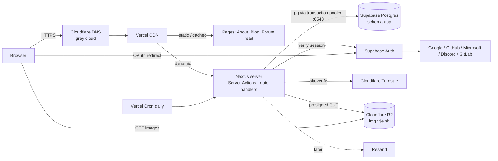
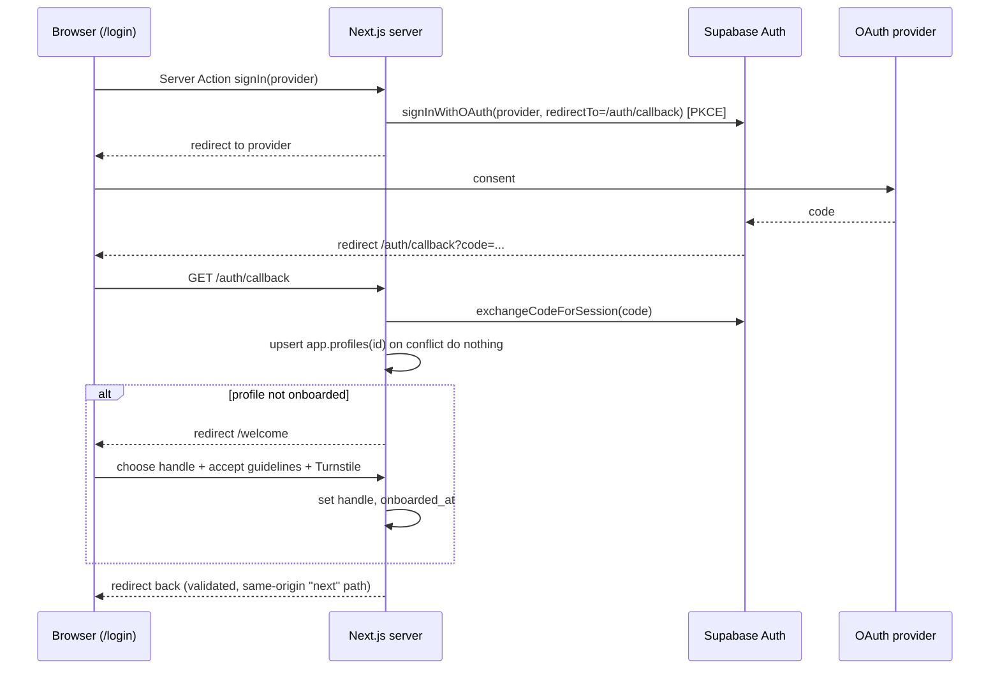

# vije.sh: Application

Status: building (phase 0 and 1 scaffold landed). This doc covers the stack, structure, hosting, auth and working conventions.
The database is specified in [database.md](database.md). The visual design is specified separately
(the chosen design variation, its spec and its HTML are added later as `docs/design.md`).

Last updated: 9 Oct 2026.

---

## 1. Purpose and scope

A personal website at **vije.sh**:

1. **About** (`/`, the landing page): who I am and what I make.
2. **Blog** (`/blog`): written only by me.
3. **Forum** (`/forum`): members sign in with OAuth and discuss. This is a real forum, not a comments section.

About, Blog and Forum are separate routes with their own URLs. The chosen design (V18.1.1,
[design.md](design.md)) adds four more pages: `/work`, `/lab`, `/photo` and `/live` (public data
feeds), seven in total, each a real server-rendered route.

### Goals
- Fast: the landing and blog pages are static HTML served from the CDN.
- Free tiers only; always online.
- HTTPS everywhere.
- **Easy to change, by me or by an agent opening a PR.** Small files and one folder per feature, so
  adding something (a form, a page, a table) touches a few predictable files and never a single
  huge page.
- **Sign-in is OAuth only** (no passwords), plus one Cloudflare Turnstile check when an account is
  created, to make bot and spam accounts expensive.
- **Well tested**: unit, integration and feature (end-to-end) tests, with coverage limits enforced in
  CI (section 13).

### Non-goals (v1)
- Self-hosting on home hardware, payments, ads, or a newsletter product.
- Sign in with Apple (needs the paid Apple Developer Program, $99 a year).

---

## 2. Decisions

| Topic | Decision | Why |
|---|---|---|
| Hosting | **Vercel Hobby** | First-class Next.js support, a preview deploy for each PR, no adapter |
| DNS | **Cloudflare, DNS-only (grey cloud)** for records that point to Vercel | Vercel doesn't support Cloudflare's proxy in front of it (section 4.2) |
| Human verification | **Cloudflare Turnstile, once per account** (on `/welcome`) | OAuth already filters most bots; one invisible check covers the cheap-to-create accounts |
| Framework | **Next.js (App Router) + TypeScript (strict)** | Conventional, file-based routes; agents know it best; Server Actions make forms cheap |
| Database | **Supabase Postgres**, used as plain Postgres | Free, standard Postgres, good dashboard |
| DB access | **`pg` (node-postgres)** with raw, parameterised SQL | Familiar, light, no ORM; works with the transaction pooler |
| Migrations | Hand-written, numbered `.sql` files | SQL is the source of truth ([database.md](database.md)) |
| DB types | Hand-written TypeScript types; sqlc is the upgrade path | Simple now, with a way to generate later |
| Auth | **Supabase Auth, used for identity only**, with our own login UI | Hosted OAuth/OIDC; the app owns roles and permissions |
| Authorisation | **In app code**, with roles in a separate `user_roles` table | Forum rules are easier to read and test in TypeScript than as RLS policies |
| OAuth providers | Google, GitHub, Microsoft, Discord, GitLab | All free; Apple excluded (paid) |
| Blog content | **Hybrid**: posts as Markdown in the repo (MDX only when a post needs a component); short notes in the database | Git-versioned posts that an agent can draft as a PR; quick notes from `/admin` |
| Styling | **Tailwind CSS v4 for layout and spacing + CSS Modules for signature components** | Tailwind for layout; CSS Modules for complex design pieces taken from the chosen variation |
| Images | **Cloudflare R2** | 10 GB free, no egress fees |
| Email | Resend (later, for forum notifications) | Free tier; no auth emails needed with OAuth only |
| Package manager | **npm**; Node.js 26 locally | Already on every machine |
| Testing | **Vitest + Testing Library + Playwright + axe**, V8 coverage with limits | Agent PRs are only safe to merge if tests catch regressions |
| Forum | Custom build in the same app | One codebase and one login |

---

## 3. Architecture



- **Static first.** About, the blog index, blog posts and forum pages for guests are prerendered or
  cached and revalidated with cache tags. Server code runs for sign-in, forms, admin and APIs.
- **Auth is separate from data.** Supabase Auth answers *who is this user*. The app's own tables
  answer *what are they allowed to do*.
- **One database connection path.** All app data goes through `src/lib/db.ts` (`pg` Pool). The
  Supabase JavaScript client is used **only** for auth.

---

## 4. Hosting and DNS

### 4.1 Vercel
- One Vercel project linked to the GitHub repo. `main` deploys to production; every PR gets a
  preview URL.
- Node.js: develop on Node 26 locally. Set the Vercel project's Node version to the newest one
  Vercel supports (check Project Settings → Build and Deployment). `package.json` `engines`
  allows both.
- **Hobby is non-commercial only.** A personal site and forum are fine. Ads, sponsorships or paid
  features would need Vercel Pro or a move (to Cloudflare Workers through OpenNext).

### 4.2 Cloudflare DNS (grey cloud)
Cloudflare stays the nameserver for `vije.sh`. Records that point to Vercel are **DNS-only**:

| Type | Name | Value | Proxy |
|---|---|---|---|
| A | `vije.sh` | the IP address Vercel shows under Project → Domains | DNS-only |
| CNAME | `www` | the CNAME target Vercel shows | DNS-only |
| (R2 custom domain) | `img` | added from the R2 bucket settings | Proxied (this is Cloudflare's own service, so the proxy is fine) |
| TXT / MX | as needed | email routing, verification | — |

- If a CAA record exists, it must allow `letsencrypt.org` (Vercel issues certificates through Let's Encrypt).
- Redirect `www` to the apex domain in Vercel.
- Turn on HSTS (through Vercel headers) once HTTPS is confirmed working.

**Why not the orange cloud:** two CDNs in a row cause stale pages after revalidation, can block
Vercel's certificate renewal challenge, hide real visitor IP addresses from Vercel's DDoS protection,
and aren't supported. The cost is losing Cloudflare's WAF, Bot Fight Mode and 'Under Attack' mode.
Turnstile covers human checks; Vercel adds DDoS protection and basic firewall rules.

### 4.3 Free-tier limits

Check these before launch; free tiers change often.

| Service | Relevant limits |
|---|---|
| Vercel Hobby | Non-commercial; about 100 GB transfer and 1M function invocations a month; cron jobs run at most once a day (timing not exact); image optimisation quota is small |
| Supabase Free | 500 MB database; 50k monthly active users for auth; 2 active projects; **pauses after 7 days of inactivity**; no downloadable backups |
| Cloudflare R2 | 10 GB storage; 1M write and 10M read operations a month; no egress fees |
| Turnstile | Free |
| Resend | About 3,000 emails a month, 100 a day |

**Supabase pausing:** a Vercel Cron job calls `/api/cron/keepalive` once a day. The route checks
`CRON_SECRET` and runs one cheap query against the database. If that ever stops being enough, use a
GitHub Actions schedule as a backup, or move the backend later (for example to GKE, as planned).

---

## 5. Tech stack

| Layer | Choice | Notes |
|---|---|---|
| Framework | Next.js App Router (latest stable), React, TypeScript `strict` | Server Components by default; `"use client"` only for islands |
| Styling | Tailwind CSS v4 + CSS Modules | Design tokens as CSS variables in `src/styles/tokens.css`, mapped into Tailwind with `@theme` |
| Fonts | `next/font/google` (downloaded at build, self-hosted, Latin subset): Space Grotesk, JetBrains Mono | No requests to Google from the browser |
| Database | `pg` (node-postgres), `import * as pg from "pg"` | Connects through the Supabase transaction pooler ([database.md](database.md#8-app-access-pg)) |
| Validation | `zod` | Every form input and route parameter |
| Auth | `@supabase/ssr` + `@supabase/supabase-js` (auth only) | Cookie-based sessions with PKCE |
| Bot protection | Cloudflare Turnstile | Widget on the client; `siteverify` on the server |
| Markdown (all posts and notes) | `unified`: `remark-parse`, `remark-frontmatter`, `remark-gfm`, `remark-rehype`, `@shikijs/rehype` (code highlighting at build time), `rehype-slug`, `rehype-sanitize` (database notes only), `rehype-stringify` | One pipeline for git posts and database notes |
| MDX (opt-in) | `@next/mdx` with the same remark and rehype plugins | Only for git posts that need an interactive component |
| Object storage | `@aws-sdk/client-s3` + `@aws-sdk/s3-request-presigner` → R2 | Presigned uploads |
| Image resizing | `sharp` in the upload Server Action | A few widths created at upload |
| Email (later) | Resend | Forum notifications |
| Tests | Vitest (unit, component, integration), Testing Library, Playwright (feature tests), `@axe-core/playwright`, `@vitest/coverage-v8` | Section 13 |
| Lint and format | ESLint (Next.js config) + Prettier | |
| CI | GitHub Actions + Vercel preview deploys | Section 12 |

---

## 6. Project structure

```
.
├── AGENTS.md                    # added later: conventions for coding agents
├── docs/
│   ├── application.md           # this file
│   ├── database.md              # schema, migrations, query conventions
│   └── design.md                # added later from the chosen variation
├── content/
│   └── blog/
│       └── <slug>/              # one folder per post
│           ├── index.md         # or index.mdx when the post needs a component
│           └── *.webp|png|svg   # images sit next to the post
├── scripts/
│   └── copy-blog-assets.ts      # prebuild: content/blog/<slug>/* images → public/blog/<slug>/
├── public/                      # static files, fonts, favicons
├── supabase/
│   ├── migrations/              # 0001_init.sql, 0002_... (source of truth)
│   └── seed.sql                 # categories and other starter rows
├── src/
│   ├── app/
│   │   ├── (site)/              # public pages share one layout (tab bar, footer)
│   │   │   ├── page.tsx                     # /         About
│   │   │   ├── blog/page.tsx                # /blog
│   │   │   ├── blog/[slug]/page.tsx         # /blog/:slug  (git post or database note)
│   │   │   ├── forum/page.tsx               # /forum
│   │   │   ├── forum/[category]/page.tsx
│   │   │   ├── forum/[category]/[thread]/page.tsx
│   │   │   ├── u/[handle]/page.tsx          # member profile
│   │   │   ├── login/page.tsx               # our own sign-in UI (static + island)
│   │   │   ├── welcome/page.tsx             # onboarding: handle + Turnstile (own CSP)
│   │   │   └── guidelines/page.tsx          # community guidelines, accepted on /welcome
│   │   ├── auth/callback/route.ts           # OAuth code exchange
│   │   ├── auth/signout/route.ts
│   │   ├── api/me/route.ts                  # signed-in user for client islands (no-store)
│   │   ├── admin/                           # dynamic, admin only, noindex
│   │   ├── api/cron/keepalive/route.ts
│   │   ├── rss.xml/route.ts
│   │   ├── sitemap.ts
│   │   └── robots.ts
│   ├── features/                # one folder per feature
│   │   ├── auth/                # session helpers, login buttons, onboarding
│   │   ├── blog/                # git post loader, notes queries, admin actions
│   │   ├── forum/               # queries, actions, components, limits
│   │   ├── moderation/
│   │   └── uploads/
│   ├── components/
│   │   └── ui/                  # design-system primitives (Button, Cell, Stamp, Tabs...)
│   ├── lib/
│   │   ├── db.ts                # pg Pool + withTransaction() (server-only)
│   │   ├── env.ts               # zod-validated environment variables
│   │   ├── supabase/            # server and browser auth clients
│   │   ├── authz.ts             # roles, can(), requireRole()
│   │   ├── turnstile.ts         # verifyTurnstile()
│   │   ├── rate-limit.ts
│   │   ├── markdown.ts          # the one Markdown → HTML pipeline (trusted and sanitised modes)
│   │   └── r2.ts
│   ├── db/
│   │   └── types.ts             # hand-written row types
│   ├── styles/
│   │   ├── tokens.css           # colour, type, spacing tokens (from design.md)
│   │   └── globals.css          # Tailwind import, @theme mapping, base styles
│   └── proxy.ts                 # session refresh (called middleware.ts before Next.js 16)
├── tests/
│   ├── db/bootstrap.sql         # Supabase stand-ins for the test database (section 13.2)
│   ├── helpers/                 # factories, test sign-in, fixtures
│   └── e2e/                     # Playwright feature tests (*.spec.ts)
├── vitest.config.mts            # projects: unit, component, integration
├── playwright.config.ts
├── .env.example
└── .env.test.example
```

### Layout of a feature folder
```
src/features/forum/
├── queries.ts        # reads (import "server-only"; SQL lives here)
├── mutations.ts      # writes (SQL, used by actions)
├── actions.ts        # "use server" Server Actions: validate → authorise → mutate → revalidate
├── schemas.ts        # zod schemas for inputs
├── limits.ts         # rate-limit rules for this feature
├── components/       # ThreadRow.tsx, ReplyForm.tsx (+ .module.css where needed)
├── *.test.ts(x)      # unit and component tests, next to the code
└── *.int.test.ts     # integration tests (real Postgres)
```

**Rules:**
- SQL lives only in `queries.ts` and `mutations.ts`. Pages and components never import `db.ts`.
- Every Server Action follows the same order: **parse (zod) → current user → `can()` → rate
  limit → mutation → `revalidateTag`**.
- Keep logic out of pages and components (put it in plain functions) so unit tests can reach it.
- Server-only modules start with `import "server-only"`.
- Shared UI primitives live in `components/ui`; feature-specific UI stays in its feature folder.

---

## 7. Rendering and caching

**Cache Components is on** (`cacheComponents: true`, the Next.js 16 default): routes are
prerendered into a static shell; data comes from `'use cache'` functions (with `cacheLife` /
`cacheTag`) or sits under `<Suspense>`. Read the bundled docs in `node_modules/next/dist/docs/`.

| Route | Mode | Revalidated by |
|---|---|---|
| `/` | Static | Build; tag `blog` (for "latest posts"); default-pin feeds by their `cacheLife` |
| `/work`, `/lab`, `/photo` | Static | Build |
| `/live` | Static (ISR) | Each feed's `cacheLife` (shortest: 5 min) |
| `/api/feeds/[key]` | Static per feed (`generateStaticParams`, ISR) | Feed `cacheLife`; tags `feeds`, `feed:<key>` |
| `/blog` | Static | Build (git posts) + tag `blog` (notes) |
| `/blog/[slug]` | Static (`generateStaticParams`) | Build (git posts); tag `post:<slug>` (notes) |
| `/rss.xml`, `/sitemap.xml` | Static | Tag `blog` |
| `/forum`, `/forum/[category]` | Cached | Tags `forum`, `category:<slug>` |
| `/forum/[category]/[thread]` | Cached for everyone | Tag `thread:<id>` on reply or moderation |
| `/u/[handle]` | Cached | Tag `profile:<id>` |
| `/login`, `/welcome` | Static shell + client island | — |
| `/admin/**` | Dynamic, never cached, `noindex` | — |

- **Pages never read the auth cookie.** That would make them dynamic. Signed-in UI (user menu,
  reply box, "New thread" button) is a small client island. It reads the session in the browser and
  shows controls; the server checks permissions again when the action runs.
- Publishing a note, creating a reply or a moderation action calls `revalidateTag()` with the
  affected tags.
- Performance budget for `/`: HTML + critical CSS under 30 KB gzipped; client JavaScript only for
  the theme toggle and small islands (target under 50 KB gzipped); LCP under 1.5 s on a fast 4G
  profile. Lighthouse CI will enforce these later.

---

## 8. Authentication

### 8.1 Model
- **Supabase Auth is the identity provider**: it runs the OAuth flows, stores the identities in
  `auth.users` and issues the session JWT (stored in HttpOnly cookies by `@supabase/ssr`).
- **The app owns everything else**: `app.profiles`, `app.user_roles`, `app.user_bans` (see
  [database.md](database.md)). The app never writes to the `auth` schema.
- Providers: **Google, GitHub, Microsoft (Supabase provider `azure`, tenant `common`, so both
  personal and work accounts work), Discord, GitLab**. No passwords and no magic links.
- Use Supabase's **publishable key** in the browser. The **secret key** is used server-side in one
  place only: deleting an account (8.6).
- Supabase links identities that share the same verified email address to one user automatically.

### 8.2 Sign-in flow



- **Turnstile runs once per account, on `/welcome`.** An account can't post until onboarding is
  complete, so every account that can post has passed one check. Returning users never see it
  (see 10.2).
- The `next` redirect parameter must be a relative path on this site (reject `//`, protocols and
  other hosts) to prevent open redirects.
- `proxy.ts` refreshes the session cookie on requests to dynamic routes only (`/admin`, `/welcome`,
  `/auth`, Server Action posts). Static pages are excluded by its matcher.

### 8.3 What Supabase gives the app
After the callback, `@supabase/ssr` stores the session in HttpOnly cookies (`sb-<project-ref>-auth-token`,
split into chunks if large). The session holds an **access token** (a short-lived signed JWT, 1 hour
by default) and a **refresh token**. On every server request that needs the user, the app calls
`supabase.auth.getClaims()`. This checks the JWT signature against the project's public signing keys
(fetched once and cached; no round trip per request) and returns its claims:

| Claim | Example | Use |
|---|---|---|
| **`sub`** | `"6f1c…-uuid"` | **The user's id** (`auth.users.id`). This is the only thing the app needs; it's the primary key of `app.profiles` |
| `email` | `"me@example.com"` | Display or contact only; never use it as the identity |
| `role` | `"authenticated"` | **Not your app role.** This is the Postgres role for Supabase's Data API. Ignore it |
| `app_metadata.provider` / `providers` | `"github"`, `["github","google"]` | Which providers are linked (shown on the account page) |
| `user_metadata` | `full_name`, `avatar_url`, `name`, `user_name`… | Profile hints from the provider, used to prefill `/welcome`. Users can edit this, so never trust it for permissions |
| `session_id`, `aal`, `iat`, `exp`, `iss`, `aud` | | Session bookkeeping; checked by `getClaims()` |

**Never trust `getSession()` on the server**: it reads the cookie without verifying it.

So the request path is: **cookie → `getClaims()` → `sub` → one SQL query in your tables → roles and
ban status → `can()`**.

```ts
// src/features/auth/session.ts
import "server-only";
import { cache } from "react";

export const getCurrentUser = cache(async (): Promise<CurrentUser | null> => {
  const supabase = await createSupabaseServerClient();
  const { data } = await supabase.auth.getClaims();
  const userId = data?.claims.sub;
  if (!userId) return null;
  return loadCurrentUser(userId); // profile + user_roles + active ban, one query (database.md section 7)
});
```

- `cache()` means one lookup per request, however many components ask.
- App roles are **not** copied into the JWT (Supabase's custom access token hook could do that).
  Roles read from the table take effect immediately when granted or revoked; roles in a token stay
  stale until the token refreshes.

### 8.4 Creating an account
With OAuth only, **there is no separate sign-up form**. "Continue with GitHub" both signs in and
signs up:

1. **First time:** Supabase creates the `auth.users` row by itself. The callback finds no
   `app.profiles` row, inserts one (`id = sub`, display name and avatar prefilled from
   `user_metadata`) and redirects to `/welcome`.
2. **`/welcome`:** the user picks a handle, accepts the community guidelines and passes Turnstile.
   The app sets `handle` and `onboarded_at`, and the user is now a **member**.
3. **Later visits:** the profile exists and is onboarded, so the callback goes straight back to the
   page they came from.

- **Closing sign-ups:** Supabase Dashboard → Authentication → Settings → "Allow new users to sign
  up" = off. Existing users (you) can still sign in. Keep it **off until the forum opens**
  (phase 4), so only the admin account exists while the blog is built.
- **A second provider:** signing in with Google using the same verified email as an existing GitHub
  login links to the same user (same `sub`), so there is no duplicate account.

### 8.5 Signing out
`/auth/signout` (POST) calls `supabase.auth.signOut()`, which clears the cookies and revokes the
refresh token, then redirects home.

### 8.6 Deleting an account
A "Delete my account" action on the account page (after the user confirms) calls
`supabase.auth.admin.deleteUser(sub)` with the **secret key**, server-side only. The
`on delete cascade` removes the profile, roles and notifications. Threads and replies stay with the
author shown as "[deleted]" ([database.md](database.md#2-conventions)).

### 8.7 Authorisation
Roles live in `app.user_roles` (see [database.md](database.md#4-roles)). "Member" is implicit: any
onboarded user who isn't banned. "Guest" means not signed in.

`src/lib/authz.ts` holds all permission rules in one place:

```ts
type Action =
  | "thread.create" | "reply.create" | "post.edit_own" | "post.hide"
  | "thread.lock" | "thread.pin" | "user.ban" | "blog.write" | "report.review";

export function can(user: CurrentUser | null, action: Action, ctx?: { categoryId?: string; authorId?: string; locked?: boolean; staffOnly?: boolean }): boolean;
export async function requireRole(role: Role): Promise<CurrentUser>; // throws / redirects
```

| Action | Guest | Member | Moderator (global or that category) | Admin |
|---|---|---|---|---|
| Read public content | yes | yes | yes | yes |
| Create a thread (not in a staff-only category) | — | yes | yes | yes |
| Reply (thread not locked) | — | yes | yes | yes |
| Edit own post (within 30 min) | — | yes | yes | yes |
| Report | — | yes | yes | yes |
| Hide or unhide, lock, pin, move | — | — | yes | yes |
| Ban a user | — | — | global moderators only | yes |
| Blog, roles, categories | — | — | — | yes |

The first admin is granted by hand in SQL (see [database.md](database.md#granting-the-first-admin)).
Admin rights are never self-service.

---

## 9. Blog (hybrid)

| | Git posts | Notes |
|---|---|---|
| Source | `content/blog/<slug>/index.md` (or `index.mdx`) | `app.posts` table |
| Written in | Any editor, or an agent PR | `/admin` Markdown editor with preview |
| Published by | Merging to `main` | Setting status to `published` (revalidates tags) |
| Rendering | The shared Markdown pipeline in **trusted** mode (raw HTML allowed) | The same pipeline in **sanitised** mode (no raw HTML) |
| URL | `/blog/<slug>` | `/blog/<slug>` |

### 9.1 Format: Markdown by default, MDX only when needed
- **Write `index.md`.** Plain prose with no markup is already valid Markdown, so "normal" writing
  works as-is. Markdown adds headings, links, lists, code blocks and tables (GFM) when wanted. It
  previews on GitHub and in VS Code, any agent can edit it, it stays portable if the site moves, and
  it uses **exactly the same renderer as database notes**, so both look identical.
- **Rename to `index.mdx`** only when a post needs an interactive component, for example the memory
  calculator inside an article. MDX is code: it can import components and break the build, so it's
  opt-in per post.
- Don't use raw `.html` posts. Their styles would drift from the design system and they're hard to edit.

### 9.2 Frontmatter (validated with zod at build; a bad field fails the build)
```yaml
---
title: Planning this site
date: 2026-10-05
summary: Why vije.sh is static-first, and what runs on the server.
tags: [notes, engineering]
visibility: public        # public | unlisted
draft: false              # true = shown locally and on preview deploys, never in production
updated: 2026-10-07       # optional
---
```
The folder name is the slug. Reading time is computed. `draft: true` lets an agent open a PR with a
new post that you can read on the preview URL before it goes live.

### 9.3 Images
Images sit next to `index.md` (subfolders are fine) and are referenced relatively
(``), so they preview correctly in editors and on GitHub. `npm run dev` and
`npm run build` first run `scripts/copy-blog-assets.ts`, which copies them to `public/blog/<slug>/`
(gitignored; restart `dev` after adding an image). The rehype plugin in
`src/features/blog/rehype-post.ts` rewrites `./ship.webp` to `/blog/<slug>/ship.webp`, fills in
width and height, and lazy-loads it. An image alone on its line with a title
(``) becomes a figure with that caption. The build fails if an image is
missing, sits outside the post folder, or comes from another site (the CSP only allows this origin
and `img.vije.sh`). Keep images to WebP, PNG, JPEG or SVG at 1600 px wide or less.

### 9.4 Merging the two sources
- `src/features/blog/posts.ts` reads `content/blog/*/index.{md,mdx}` at build time for
  `generateStaticParams`, the index and RSS.
- **Shared slug space.** A build check fails if a git slug matches a published note. The admin
  "publish" action rejects a slug that matches a git post (it reads a manifest generated at build
  time).
- `/blog` and RSS merge both sources, sorted by date. `unlisted` items are reachable by URL only;
  `private` notes appear only in `/admin`.

---

## 10. Forms, Turnstile and rate limits

### 10.1 Adding a form (the recipe)
1. Add a zod schema in `features/<x>/schemas.ts`.
2. Add a mutation in `features/<x>/mutations.ts` (SQL), plus a migration if a new table is needed
   (see [database.md](database.md#migrations)).
3. Add a Server Action in `features/<x>/actions.ts` in the standard order (section 6).
4. Add a component in `features/<x>/components/` that uses `<form action={...}>` and
   `useActionState`.
5. Add tests (section 13.6): a unit test for the schema and the permission rule, an integration
   test for the mutation, and a Playwright feature test for the main path.

Server Actions come with Origin checks (CSRF protection) from Next.js. Don't add extra API routes
for forms.

### 10.2 Turnstile
- **Used once per account:** on `/welcome`, the step that turns a signed-in identity into a member
  who can post. Signing in again later doesn't show it.
- **Why not on the login button:** Google and Microsoft accounts are costly to mass-create because
  of their own bot checks and phone verification, so the login check would mostly repeat theirs.
  GitHub, Discord and GitLab accounts are cheaper to create, so one check at onboarding stays. In
  managed mode, most people never see a challenge.
- **The rest of the spam defence:** rate limits (stricter for new accounts, 10.3), reports and bans.
- **If spam shows up on a specific form,** add `<Turnstile />` to it and `verifyTurnstile()` to its
  action. It's a small change.
- `<Turnstile />` (in `components/ui`) renders the widget and puts the token in a hidden field
  named `cf-turnstile-response`.
- `verifyTurnstile(token, ip)` in `lib/turnstile.ts` posts to
  `https://challenges.cloudflare.com/turnstile/v0/siteverify` with `TURNSTILE_SECRET_KEY` and checks
  `success`, `hostname` and `action`.

### 10.3 Rate limits
Counted in the database from recent rows (no extra service needed). Rules live in each feature's
`limits.ts`:

| Action | Limit (account under 24 h old) | Limit (normal account) |
|---|---|---|
| New thread | 1 per hour | 5 per hour |
| Reply | 5 per hour | 30 per hour |
| Report | 5 per day | 20 per day |
| Image upload | none | 20 per day (admin only at first) |

---

## 11. Images (R2)
- Bucket `vije-sh-images`, public through the custom domain `img.vije.sh`.
- Upload flow: a Server Action checks the role, validates the type (`image/png|jpeg|webp|avif`) and
  size (5 MB or less), resizes with `sharp` to 480, 960 and 1600 px WebP, and writes the files to R2
  with keys `u/<user_id>/<uuid>-<width>.webp`. It records the upload in `app.images`.
- Pages use `` pointing at `img.vije.sh` (or `next/image` with `unoptimized`), so
  Vercel's image optimisation quota isn't used up.
- Images in git posts sit next to the post (section 9.3) and are served from `public/blog/<slug>/`.

---

## 12. Environments, configuration and CI

### 12.1 Environments
| Environment | App | Database and auth |
|---|---|---|
| Local | `npm run dev` | Supabase project **vije-sh-dev** (free tier allows 2 projects; no Docker needed) |
| Preview (PRs) | Vercel preview URL | **vije-sh-dev** |
| Production | `vije.sh` | Supabase project **vije-sh-prod** |

Each OAuth provider app lists the callback URLs for both Supabase projects. Supabase's allowed
redirect URLs include `http://localhost:3000/**`, the Vercel preview pattern and `https://vije.sh/**`.

### 12.2 Environment variables (`.env.example`)
| Name | Scope | Notes |
|---|---|---|
| `DATABASE_URL` | server | Supabase **transaction pooler** URL, port 6543, user `app_rw.<project-ref>` |
| `DATABASE_CA_CERT` | server | Supabase root certificate (PEM) for verified TLS |
| `NEXT_PUBLIC_SUPABASE_URL` | public | |
| `NEXT_PUBLIC_SUPABASE_PUBLISHABLE_KEY` | public | |
| `SUPABASE_SECRET_KEY` | server | Used only for account deletion (8.6) |
| `NEXT_PUBLIC_TURNSTILE_SITE_KEY` | public | |
| `TURNSTILE_SECRET_KEY` | server | |
| `R2_ACCOUNT_ID`, `R2_ACCESS_KEY_ID`, `R2_SECRET_ACCESS_KEY`, `R2_BUCKET` | server | Token limited to the one bucket |
| `NEXT_PUBLIC_IMAGE_BASE_URL` | public | `https://img.vije.sh` |
| `CRON_SECRET` | server | Vercel sends it as a Bearer token |
| `NEXT_PUBLIC_SITE_URL` | public | `https://vije.sh` |
| `RESEND_API_KEY` | server | Later |

`src/lib/env.ts` validates these with zod at startup; a missing variable fails the build.

### 12.3 Scripts
```
npm run dev | build | start
npm run lint | typecheck | format
npm run db:migrate  # applies supabase/migrations (see database.md)
```
Test scripts are listed in section 13.7.

### 12.4 CI (GitHub Actions on every PR)
A Postgres service container runs alongside the job (section 13.2).
1. `npm ci`
2. `npm run lint && npm run typecheck`
3. `npm run db:test:setup` (also proves every migration applies to an empty database)
4. `npm run test:coverage` (fails if coverage drops below the limits in 13.5)
5. `npm run build` (includes the frontmatter validation and slug checks)
6. `npm run test:e2e` against the local production build and the test database
7. Upload the coverage report (lcov + HTML) and the Playwright report as artifacts; write a
   coverage summary to the job summary
8. Later: Lighthouse CI with the budgets in section 7

Branch protection on `main`: CI must pass; no force-pushes.

---

## 13. Testing

Tests are part of every change. A PR that adds behaviour without tests isn't ready to merge.

### 13.1 Layers
| Layer | Tool | Covers | Lives in | Runs |
|---|---|---|---|---|
| Unit | Vitest (node) | Pure logic: zod schemas, `can()`, rate-limit rules, Markdown sanitising, slug and `next`-redirect validation, post frontmatter, the env guard | `*.test.ts` next to the code | Every PR; no network or database |
| Component | Vitest + Testing Library (jsdom) | Client components: forms and their error states, theme toggle, signed-in islands | `*.test.tsx` next to the code | Every PR |
| Integration | Vitest against a real Postgres | `queries.ts` / `mutations.ts`, Server Actions (session mocked), the auth callback's profile upsert, migrations, constraints and triggers (such as `reply_count`) | `*.int.test.ts` next to the code | Every PR |
| Feature (end-to-end) | Playwright (Chromium; WebKit and a mobile viewport on `main`) | User journeys on `next build && next start`: read the blog, RSS, sign in (test mode), onboarding, create a thread, reply, a moderator hides a reply, a banned user is blocked, the admin publishes a note, theme toggle, keyboard navigation | `tests/e2e/*.spec.ts` | Every PR |
| Accessibility | `@axe-core/playwright` | No serious or critical violations on every route | Inside the feature tests | Every PR |
| Performance | Lighthouse CI | Budgets in section 7 | — | Later |

Async Server Components are hard to unit-test, so they stay thin (they fetch and render) and are
covered by feature tests. Logic lives in plain functions that unit tests can reach.

### 13.2 Test database
- **CI:** a GitHub Actions service container running `postgres:<same major version as Supabase>`.
- **Local:** `docker run --rm -p 54329:5432 -e POSTGRES_PASSWORD=test postgres:17`, or a native
  Postgres. Set `TEST_DATABASE_URL` in `.env.test`.
- `tests/db/bootstrap.sql` creates the Supabase pieces the migrations depend on: the roles `anon`
  and `authenticated`, the schema `extensions`, and a minimal `auth.users (id uuid primary key,
  email text)`.
- `npm run db:test:setup` runs the bootstrap, then every file in `supabase/migrations/` in order,
  then `seed.sql`.
- **Isolation:** integration files run one at a time. `beforeEach` truncates the `app` tables
  (`restart identity cascade`). Factories in `tests/helpers/factories.ts` create the fixtures, for
  example `createUser({ roles: ["moderator"] })` or `createThread()`.
- **Safety:** the setup script and the test helpers refuse any database URL whose host isn't
  `localhost` or `127.0.0.1`. Tests never touch the Supabase dev or prod projects, because the
  truncation would wipe them.

### 13.3 What gets mocked
Only mock what leaves the app; the database is always real.

| Boundary | Unit / integration | Feature tests |
|---|---|---|
| Supabase Auth | `getCurrentUser()` mocked with `vi.mock` | Test sign-in (13.4) |
| Turnstile | `verifyTurnstile()` mocked | Cloudflare's test keys, which always pass: site key `1x00000000000000000000AA`, secret `1x0000000000000000000000000000000AA`. With the test secret, `verifyTurnstile()` answers locally (Cloudflare would accept any token); e2e stubs the widget script |
| R2 | S3 client mocked | Upload tests stub the action |
| Resend | Mocked | Never called |
| Postgres | Real (test database) | Real (test database) |

### 13.4 Signing in during feature tests
Real OAuth can't run in CI. When `AUTH_MODE=test`, `getCurrentUser()` reads a `test_session` cookie,
signed with `TEST_AUTH_SECRET` (HMAC), instead of asking Supabase. Playwright fixtures `asMember`,
`asModerator`, `asAdmin` and `asBanned` create the user in the test database and set the cookie.

**Guard:** `src/lib/env.ts` refuses to start if `AUTH_MODE=test` while `VERCEL` is set (Vercel sets
it on every build and deployment), and a unit test covers that guard. The real OAuth flow is covered
by integration tests of the callback logic (Supabase client mocked) and a manual sign-in check with
each provider on the preview deploy before a release.

### 13.5 Coverage
- `@vitest/coverage-v8`, measured across the unit, component and integration projects together.
- **Limits (CI fails below them):**
  - Global: 80% of lines, statements and functions; 75% of branches.
  - Security-critical files: 95% of lines and branches. These are `src/lib/authz.ts`,
    `src/lib/rate-limit.ts`, `src/lib/turnstile.ts`, `src/lib/markdown.ts`,
    `src/features/*/limits.ts`, `src/features/*/schemas.ts` and `src/features/*/actions.ts`.
- The limits only ever go up. When coverage rises, raise them in `vitest.config.mts` in the same PR.
- Excluded from coverage: `src/app/**/{page,layout}.tsx` (covered by feature tests), `*.d.ts` and
  config files.
- Feature-test coverage isn't merged into these numbers, because collecting it from Next.js builds
  is fragile. Instead, `tests/e2e/routes.spec.ts` visits every route in section 7, so a route
  without a feature test fails CI.

### 13.6 Rules for every PR
- New behaviour: tests at the lowest layer that can catch the bug, plus one feature test for any
  new user-facing flow.
- Bug fix: write a failing test first.
- New migration: integration tests for its constraints and triggers.
- New permission: a `can()` table test with a row for every kind of user (guest, unonboarded,
  member, banned, category moderator, global moderator, admin).
- No `.only` and no skipped tests without a linked issue (enforced by ESLint).
- Playwright retries once in CI only; a flaky test is fixed or quarantined the same day.

### 13.7 Scripts
```
npm test                # vitest: unit + component (fast, no database)
npm run test:int        # vitest: integration project (needs TEST_DATABASE_URL)
npm run test:coverage   # all vitest projects with coverage and limits
npm run test:e2e        # playwright: builds, starts the app on the test database, runs the specs
npm run db:test:setup   # bootstrap + migrations + seed on the test database
```

---

## 14. Security
- **Database exposure:** app tables live in the `app` schema, which is **not exposed** through
  Supabase's Data API, and `anon` and `authenticated` have no grants on it. The app connects as a
  least-privilege role (`app_rw`). See [database.md](database.md#access-and-roles).
- **Markdown:** database content is rendered through `rehype-sanitize`; raw HTML is stripped and
  links get `rel="nofollow ugc noopener"`. Only git posts (Markdown and MDX from the repo) are
  trusted.
- **SQL:** `pg` parameterised queries only (`$1`, `$2`). Never build SQL by joining strings;
  dynamic identifiers come from a fixed allow-list in code.
- **Cookies:** HttpOnly, Secure, SameSite=Lax (set by `@supabase/ssr`).
- **Headers** (`next.config.ts`): HSTS, `X-Content-Type-Options: nosniff`,
  `Referrer-Policy: strict-origin-when-cross-origin`, `Permissions-Policy`, and
  `frame-ancestors 'none'`.
- **CSP:** static and partially prerendered pages can't carry a nonce, and Next.js inlines its RSC
  payload as scripts, so the baseline CSP (`src/lib/security-headers.ts`, set in `next.config.ts`)
  uses `script-src 'self' 'unsafe-inline'`, plus `connect-src` for the two browser-side feeds,
  `img-src` for `img.vije.sh`, `object-src 'none'` and `frame-ancestors 'none'`. Dynamic routes
  (`/login`, `/welcome`, `/admin`) can tighten this with a nonce CSP from `proxy.ts` later
  (`/welcome` also needs `challenges.cloudflare.com` for Turnstile).
- **Redirects:** only same-origin relative `next` paths are allowed.
- **Secrets:** stored only in Vercel environment variables; `.env*` files are gitignored except
  `.env.example`.
- **Backups:** the free tier has no downloadable backups. A nightly GitHub Action runs `pg_dump` on
  the `app` schema and uploads it to a private R2 bucket (see [database.md](database.md#backups)).

---

## 15. Design system integration
The chosen variation (its spec and HTML) goes into `docs/design.md`. When porting it:
- Tokens (colours, fonts, spacing, radii) go into `src/styles/tokens.css` as CSS variables, then
  into Tailwind's `@theme` so utilities like `bg-paper` and `text-ink` exist.
- Use Tailwind for layout, spacing and simple styling. Use CSS Modules for signature pieces
  (cut-corner buttons, stamps, washi tape, grid-paper cells and similar), one module per component
  in `components/ui`.
- Theme handling: light by default. The opt-in dark theme is a `data-theme` attribute on `<html>`,
  saved in `localStorage` and re-applied before first paint by a tiny inline script (allowed by its
  CSP hash).
- Content is always server-rendered HTML; motion respects `prefers-reduced-motion`.

---

## 16. Roadmap

| Phase | Scope |
|---|---|
| 0 | Repo scaffold (Next.js, Tailwind, ESLint), the full test setup (Vitest projects, test database, Playwright, axe, coverage limits) running in CI, `docs/`, Vercel project, Cloudflare DNS, two Supabase projects, first migration |
| 1 | Design system from the chosen variation; static About landing; deploy to `vije.sh` |
| 2 | Blog: git posts (Markdown, opt-in MDX), notes table, `/admin`, RSS, sitemap |
| 3 | Auth: `/login`, the five providers, `/welcome` onboarding, Turnstile, roles |
| 4 | Forum: categories, threads, replies, profiles, rate limits |
| 5 | Moderation: reports, hide/lock/pin, bans, moderation log; community guidelines page |
| 6 | Notifications (Resend), search (Postgres full-text), image uploads for members |
| Later | `AGENTS.md`, Lighthouse CI, reactions and mentions, moving the backend to GKE if needed |

---

## 17. Open questions
1. Which design variation (to be supplied with its spec and HTML).
2. Who can see notes: public only, or also unlisted and private (the schema supports all three).
3. Whether members can upload images in the forum (storage and moderation cost) or only link to them.
4. Whether to add Apple sign-in later if a developer account is ever bought.
