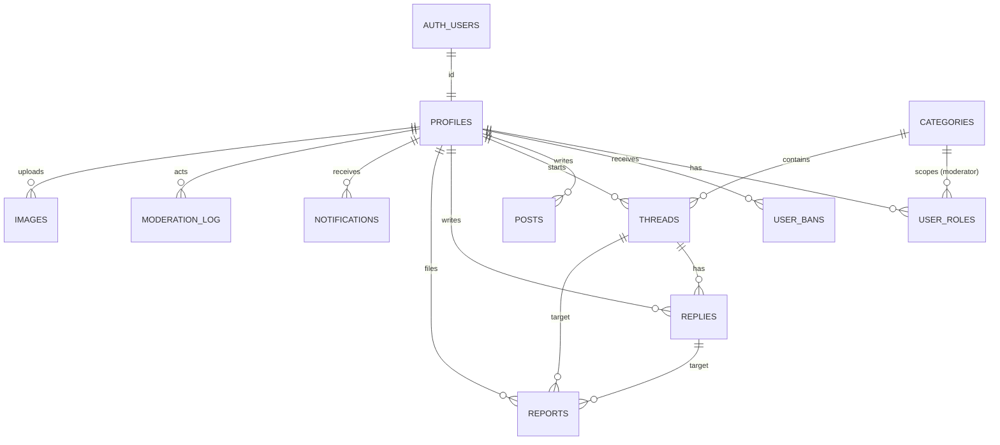

# vije.sh: Database

Status: planning. This doc covers the Postgres schema, migrations, access rules and query conventions.
The app side is in [application.md](application.md).

Last updated: 5 Oct 2026.

---

## 1. Overview

- **Engine:** Supabase Postgres (free tier), used as **plain Postgres**.
- **Two schemas matter:**
  - `auth`: owned by Supabase Auth (`auth.users`, identities). The app **reads the user id only**
    and never writes here.
  - `app`: all application tables. **Not exposed** through Supabase's Data API (PostgREST).
- **Access:** the Next.js server connects with `pg` (node-postgres) as the least-privilege role
  `app_rw` through the **transaction pooler** (port 6543).
- **Authorisation lives in the app** (`src/lib/authz.ts`), not in RLS policies. The database
  enforces integrity: foreign keys, `check` constraints and unique keys.
- **The SQL migration files are the source of truth.** TypeScript types are written by hand in
  `src/db/types.ts`.



---

## 2. Conventions

| Topic | Rule |
|---|---|
| Names | `snake_case`, plural table names, singular column names |
| Keys | `uuid` for users (matches `auth.users.id`); `bigint generated always as identity` for content |
| Time | `timestamptz` everywhere; `created_at` defaults to `now()`; `updated_at` maintained by a trigger |
| Flags | Use a nullable timestamp instead of a boolean (`hidden_at`, `locked_at`, `pinned_at`, `onboarded_at`): it records *when* as well as *whether* |
| Enums | Postgres enums for small, stable sets (`app.role`, `app.post_status`, `app.visibility`, `app.report_status`) |
| Text | Length limits as `check` constraints, so the database rejects oversized input even if app validation is missed |
| Deletes | Content is hidden, not deleted. Deleting a user keeps their threads and replies with the author set to `null` ("[deleted]") |
| Functions | `security invoker`, `set search_path = ''`, every name fully qualified |
| Indexes | Named `<table>_<columns>_idx`; partial indexes for the common "visible" filters |

---

## 3. Access and roles

### Locking out the Data API
Supabase exposes the schemas listed under Settings → API → "Exposed schemas" to anyone holding the
publishable key. **Leave `app` off that list.** The init migration also revokes everything from
`anon` and `authenticated`, so even a configuration mistake can't expose the tables. Because the
schema isn't reachable from outside, RLS isn't needed as a safety lock. Supabase's Security Advisor
only checks exposed schemas.

### The app role
Create `app_rw` **once by hand in the SQL editor** (never in a migration file, because it contains a
password):

```sql
create role app_rw login password '<generated, 32+ chars>';
grant usage on schema app to app_rw;
grant select, insert, update, delete on all tables in schema app to app_rw;
grant usage, select on all sequences in schema app to app_rw;
alter default privileges in schema app grant select, insert, update, delete on tables to app_rw;
alter default privileges in schema app grant usage, select on sequences to app_rw;
```

`app_rw` can't run DDL; migrations run as `postgres`. The shared pooler (Supavisor) accepts custom
roles; the username is `<role>.<project-ref>`:
`postgresql://app_rw.<project-ref>:<password>@<pooler-host>:6543/postgres`.
Copy the pooler host from the dashboard's **Connect** dialog; it can't be worked out from the
region name.

---

## 4. Roles

Roles are kept **in a separate table** from profiles.

| Option | Shape | Verdict |
|---|---|---|
| A. Column on profile | `profiles.role enum` | Simple, but one role per user, no scope and no history |
| **B. `user_roles` table** | One row per granted role, optionally scoped to a category | **Chosen.** Several roles per user, category moderators, who granted it and when, revoking = deleting a row |
| C. Full role-based access control | `roles`, `permissions`, `role_permissions` tables | Overkill for one admin and a few moderators; permissions stay in code (`authz.ts`) |

- Stored roles: **`admin`** (always global) and **`moderator`** (global when `category_id` is null,
  otherwise only for that category).
- **Member** is implicit: `profiles.onboarded_at is not null` and no active ban.
- **Bans** are a separate table (`user_bans`) so they keep history, a reason, who banned and an expiry.
- Every grant, revoke and ban is also written to `moderation_log`.

---

## 5. Migrations

- Files: `supabase/migrations/NNNN_short_name.sql`, numbered in order (`0001_init.sql`,
  `0002_add_reactions.sql`, ...).
- Written by hand. **Never edit a migration that has been applied**; add a new one.
- Apply (preferred): `npx supabase link --project-ref <ref>` once, then `npx supabase db push`.
  This runs the files that haven't been applied yet and records them in
  `supabase_migrations.schema_migrations`. No Docker needed. `npm run db:migrate` wraps this.
- Apply by hand: pasting a file into the SQL editor works, but then mark it as applied:
  `npx supabase migration repair --status applied NNNN`.
- Order: **dev project first**, check the preview deploy, then **prod**.
- Every migration that changes a table also updates `src/db/types.ts` **in the same PR**.
- Seed data (categories) goes in `supabase/seed.sql`, written to be safe to run twice
  (`on conflict do nothing`).

---

## 6. Schema (`0001_init.sql`)

```sql
-- 0001_init.sql
create extension if not exists citext with schema extensions;

create schema if not exists app;
revoke all on schema app from public, anon, authenticated;

-- Enums ---------------------------------------------------------------
create type app.role          as enum ('admin', 'moderator');
create type app.post_status   as enum ('draft', 'published');
create type app.visibility    as enum ('public', 'unlisted', 'private');
create type app.report_status as enum ('open', 'actioned', 'dismissed');

-- Helpers -------------------------------------------------------------
create function app.set_updated_at() returns trigger
language plpgsql security invoker set search_path = '' as $$
begin
  new.updated_at := now();
  return new;
end $$;

-- Profiles ------------------------------------------------------------
create table app.profiles (
  id            uuid primary key references auth.users (id) on delete cascade,
  handle        extensions.citext unique
                check (handle ~ '^[A-Za-z0-9_]{3,24}$'),
  display_name  text check (char_length(display_name) <= 60),
  avatar_url    text check (char_length(avatar_url) <= 500),
  bio           text check (char_length(bio) <= 500),
  onboarded_at  timestamptz,
  last_seen_at  timestamptz,
  created_at    timestamptz not null default now(),
  updated_at    timestamptz not null default now(),
  constraint profiles_onboarded_has_handle check (onboarded_at is null or handle is not null)
);
create trigger profiles_updated_at before update on app.profiles
  for each row execute function app.set_updated_at();

-- Categories ----------------------------------------------------------
create table app.categories (
  id           bigint generated always as identity primary key,
  slug         text not null unique check (slug ~ '^[a-z0-9]+(-[a-z0-9]+)*$'),
  name         text not null check (char_length(name) between 1 and 60),
  description  text check (char_length(description) <= 300),
  position     int  not null default 0,
  staff_only   boolean not null default false,   -- e.g. Announcements: only staff start threads
  created_at   timestamptz not null default now()
);

-- Roles and bans ------------------------------------------------------
create table app.user_roles (
  user_id      uuid not null references app.profiles (id) on delete cascade,
  role         app.role not null,
  category_id  bigint references app.categories (id) on delete cascade,
  granted_by   uuid references app.profiles (id) on delete set null,
  granted_at   timestamptz not null default now(),
  constraint user_roles_unique unique nulls not distinct (user_id, role, category_id),
  constraint user_roles_admin_global check (role <> 'admin' or category_id is null)
);
create index user_roles_user_id_idx on app.user_roles (user_id);

create table app.user_bans (
  id          bigint generated always as identity primary key,
  user_id     uuid not null references app.profiles (id) on delete cascade,
  reason      text not null check (char_length(reason) between 1 and 500),
  banned_by   uuid references app.profiles (id) on delete set null,
  created_at  timestamptz not null default now(),
  expires_at  timestamptz,          -- null = permanent
  lifted_at   timestamptz           -- set when lifted early
);
create index user_bans_active_idx on app.user_bans (user_id) where lifted_at is null;

-- Blog notes (git posts are Markdown files in the repo) ----------------
create table app.posts (
  id            bigint generated always as identity primary key,
  slug          text not null unique check (slug ~ '^[a-z0-9]+(-[a-z0-9]+)*$'),
  title         text not null check (char_length(title) between 1 and 200),
  summary       text check (char_length(summary) <= 300),
  body_md       text not null default '' check (char_length(body_md) <= 100000),
  status        app.post_status not null default 'draft',
  visibility    app.visibility  not null default 'public',
  tags          text[] not null default '{}',
  author_id     uuid not null references app.profiles (id),
  published_at  timestamptz,
  created_at    timestamptz not null default now(),
  updated_at    timestamptz not null default now(),
  constraint posts_published_has_date check (status = 'draft' or published_at is not null)
);
create index posts_public_feed_idx on app.posts (published_at desc)
  where status = 'published' and visibility = 'public';
create index posts_tags_idx on app.posts using gin (tags);
create trigger posts_updated_at before update on app.posts
  for each row execute function app.set_updated_at();

-- Forum ---------------------------------------------------------------
create table app.threads (
  id                bigint generated always as identity primary key,
  category_id       bigint not null references app.categories (id),
  author_id         uuid references app.profiles (id) on delete set null,
  title             text not null check (char_length(title) between 3 and 140),
  body_md           text not null check (char_length(body_md) between 1 and 20000),
  pinned_at         timestamptz,
  locked_at         timestamptz,
  hidden_at         timestamptz,
  hidden_by         uuid references app.profiles (id) on delete set null,
  reply_count       int not null default 0,
  last_activity_at  timestamptz not null default now(),
  edited_at         timestamptz,
  created_at        timestamptz not null default now(),
  updated_at        timestamptz not null default now(),
  search            tsvector generated always as (
                      setweight(to_tsvector('english'::regconfig, title), 'A') ||
                      setweight(to_tsvector('english'::regconfig, body_md), 'B')
                    ) stored
);
create index threads_category_listing_idx on app.threads
  (category_id, pinned_at desc nulls last, last_activity_at desc) where hidden_at is null;
create index threads_latest_idx on app.threads (last_activity_at desc) where hidden_at is null;
create index threads_author_idx on app.threads (author_id, created_at desc);
create index threads_search_idx on app.threads using gin (search);
create trigger threads_updated_at before update on app.threads
  for each row execute function app.set_updated_at();

create table app.replies (
  id          bigint generated always as identity primary key,
  thread_id   bigint not null references app.threads (id) on delete cascade,
  author_id   uuid references app.profiles (id) on delete set null,
  body_md     text not null check (char_length(body_md) between 1 and 20000),
  hidden_at   timestamptz,
  hidden_by   uuid references app.profiles (id) on delete set null,
  edited_at   timestamptz,
  created_at  timestamptz not null default now(),
  updated_at  timestamptz not null default now(),
  search      tsvector generated always as (to_tsvector('english'::regconfig, body_md)) stored
);
create index replies_thread_idx on app.replies (thread_id, created_at);
create index replies_author_idx on app.replies (author_id, created_at desc);
create index replies_search_idx on app.replies using gin (search);
create trigger replies_updated_at before update on app.replies
  for each row execute function app.set_updated_at();

-- Keep threads.reply_count (visible replies) and last_activity_at in sync.
create function app.replies_counter() returns trigger
language plpgsql security invoker set search_path = '' as $$
begin
  if tg_op = 'INSERT' and new.hidden_at is null then
    update app.threads
       set reply_count = reply_count + 1, last_activity_at = new.created_at
     where id = new.thread_id;
  elsif tg_op = 'DELETE' and old.hidden_at is null then
    update app.threads set reply_count = reply_count - 1 where id = old.thread_id;
  elsif tg_op = 'UPDATE' and (old.hidden_at is null) <> (new.hidden_at is null) then
    update app.threads
       set reply_count = reply_count + case when new.hidden_at is null then 1 else -1 end
     where id = new.thread_id;
  end if;
  return null;
end $$;
create trigger replies_counter
  after insert or delete or update of hidden_at on app.replies
  for each row execute function app.replies_counter();

-- Moderation ----------------------------------------------------------
create table app.reports (
  id           bigint generated always as identity primary key,
  reporter_id  uuid references app.profiles (id) on delete set null,
  thread_id    bigint references app.threads (id) on delete cascade,
  reply_id     bigint references app.replies (id) on delete cascade,
  profile_id   uuid   references app.profiles (id) on delete cascade,
  reason       text not null check (char_length(reason) between 1 and 1000),
  status       app.report_status not null default 'open',
  resolved_by  uuid references app.profiles (id) on delete set null,
  resolved_at  timestamptz,
  created_at   timestamptz not null default now(),
  constraint reports_one_target check (num_nonnulls(thread_id, reply_id, profile_id) = 1),
  constraint reports_no_duplicates unique nulls not distinct (reporter_id, thread_id, reply_id, profile_id)
);
create index reports_open_idx on app.reports (created_at) where status = 'open';

create table app.moderation_log (
  id          bigint generated always as identity primary key,
  actor_id    uuid references app.profiles (id) on delete set null,
  action      text not null check (action in (
                'hide', 'unhide', 'lock', 'unlock', 'pin', 'unpin', 'move',
                'ban', 'unban', 'role_grant', 'role_revoke', 'report_resolve')),
  thread_id   bigint references app.threads (id) on delete set null,
  reply_id    bigint references app.replies (id) on delete set null,
  profile_id  uuid   references app.profiles (id) on delete set null,
  note        text check (char_length(note) <= 1000),
  created_at  timestamptz not null default now()
);
create index moderation_log_created_idx on app.moderation_log (created_at desc);

-- Notifications (phase 6) -----------------------------------------------
create table app.notifications (
  id          bigint generated always as identity primary key,
  user_id     uuid not null references app.profiles (id) on delete cascade,
  type        text not null check (type in ('reply', 'mention', 'moderation')),
  actor_id    uuid references app.profiles (id) on delete set null,
  thread_id   bigint references app.threads (id) on delete cascade,
  reply_id    bigint references app.replies (id) on delete cascade,
  read_at     timestamptz,
  created_at  timestamptz not null default now()
);
create index notifications_unread_idx on app.notifications (user_id, created_at desc)
  where read_at is null;

-- Images (R2 objects) -------------------------------------------------
create table app.images (
  id            uuid primary key default gen_random_uuid(),
  owner_id      uuid references app.profiles (id) on delete set null,
  key_prefix    text not null unique,      -- u/<user_id>/<uuid>; files are <prefix>-<width>.webp
  widths        int[] not null,
  width         int not null,
  height        int not null,
  bytes         int not null,
  alt           text check (char_length(alt) <= 300),
  created_at    timestamptz not null default now()
);
create index images_owner_idx on app.images (owner_id, created_at desc);

-- Lock out Data API roles (belt and braces; `app` is also not exposed) --------
revoke all on all tables    in schema app from public, anon, authenticated;
revoke all on all sequences in schema app from public, anon, authenticated;
revoke all on all functions in schema app from public, anon, authenticated;
```

### Seed (`supabase/seed.sql`)
```sql
insert into app.categories (slug, name, description, position, staff_only) values
  ('announcements', 'Announcements', 'News about the site.',             0, true),
  ('engineering',   'Engineering',   'Backend, infrastructure, tooling.', 1, false),
  ('local-ai',      'Local AI',      'Small models on your own hardware.', 2, false),
  ('games',         'Games',         'Saltbound and other projects.',     3, false),
  ('off-topic',     'Off-topic',     'Everything else.',                  4, false)
on conflict (slug) do nothing;
```

### Granting the first admin
After signing in once (which creates the profile):
```sql
insert into app.user_roles (user_id, role)
select id, 'admin' from app.profiles where handle = 'vije';
```

---

## 7. Common queries

These show the intended shapes. The real queries live in `src/features/*/queries.ts`.

```sql
-- Current user with roles and ban status (one round trip; used by getCurrentUser)
select p.id, p.handle, p.display_name, p.onboarded_at,
       coalesce(json_agg(json_build_object('role', r.role, 'category_id', r.category_id))
                filter (where r.role is not null), '[]') as roles,
       exists (select 1 from app.user_bans b
                where b.user_id = p.id and b.lifted_at is null
                  and (b.expires_at is null or b.expires_at > now())) as banned
from app.profiles p
left join app.user_roles r on r.user_id = p.id
where p.id = $1
group by p.id;

-- Category listing
select t.id, t.title, t.reply_count, t.last_activity_at, t.pinned_at, t.locked_at,
       p.handle as author_handle
from app.threads t
left join app.profiles p on p.id = t.author_id
where t.category_id = $1 and t.hidden_at is null
order by t.pinned_at desc nulls last, t.last_activity_at desc
limit 30;

-- Rate limit check (replies in the last hour)
select count(*)::int from app.replies
where author_id = $1 and created_at > now() - interval '1 hour';

-- Search
select id, title, ts_rank(search, q) as rank
from app.threads, websearch_to_tsquery('english', $1) q
where search @@ q and hidden_at is null
order by rank desc limit 20;
```

---

## 8. App access (pg)

```ts
// src/lib/db.ts
import "server-only";
import * as pg from "pg";
import { attachDatabasePool } from "@vercel/functions";
import { env } from "@/lib/env";

export const pool = new pg.Pool({
  connectionString: env.DATABASE_URL,
  ssl: { ca: env.DATABASE_CA_CERT },  // Supabase root certificate: encrypts and verifies the server
  max: 1,                             // one connection per serverless instance; the pooler multiplexes
  idleTimeoutMillis: 5_000,
  connectionTimeoutMillis: 10_000,
});

// Lets Vercel close idle clients before it suspends the instance.
attachDatabasePool(pool);

export async function withTransaction<T>(fn: (client: pg.PoolClient) => Promise<T>): Promise<T> {
  const client = await pool.connect();
  try {
    await client.query("begin");
    const result = await fn(client);
    await client.query("commit");
    return result;
  } catch (err) {
    await client.query("rollback");
    throw err;
  } finally {
    client.release();
  }
}
```

**Why `pg` works with the transaction pooler (6543).** Supabase's warning about the transaction
pooler concerns prepared statements and pipelining. `pg` doesn't pipeline, and parameterised
queries use *unnamed* statements, which the pooler handles. Two things to avoid: never pass a `name`
in a query config (that creates a named prepared statement), and never rely on session state
(`set`, `listen`/`notify`, temp tables, advisory locks) outside a single transaction.

**TLS:** download the root certificate from Supabase Dashboard → Database settings → SSL and store
its PEM text in the `DATABASE_CA_CERT` environment variable. Don't put `sslmode` in the URL; the
`ssl` object controls it.

Rules:
- **Parameters only:** `pool.query("select ... where id = $1", [id])`. Never join values into SQL.
  For dynamic identifiers (rare, such as a sort column), pick from a fixed allow-list in code.
- **Reads:** `const { rows } = await pool.query<ThreadRow>(sql, params)`.
- **Multi-step writes** (such as a moderation action plus its log row): `withTransaction(async (c) => { ... })`,
  using `c.query` inside, never `pool.query`.
- **Type mapping by pg:** `timestamptz` → `Date`; `int4` → `number`; **`int8` (`bigint`, all
  content ids) and `numeric` → `string`**; `uuid` → `string`; `text[]` → `string[]`;
  `json`/`jsonb` → parsed object; enums → `string`. Content ids are therefore typed as `string`.
  Gotcha: arrays of enums come back as a raw string such as `'{a,b}'`. Cast them in SQL
  (`roles::text[]`) if one is ever selected.
- Supabase's direct connection is IPv6-only on the free plan; Vercel must use the **pooler** host,
  which is IPv4.

---

## 9. Types (`src/db/types.ts`)

Hand-written, one interface per table named `<Table>Row`, with fields in **snake_case exactly as
the columns are** (`pg` returns column names unchanged). No mapping layer, so a type can be checked
against the SQL at a glance. Narrower types for query results are made with `Pick<>` or written out
where a query joins or aliases columns.

```ts
export type Role = "admin" | "moderator";
export type PostStatus = "draft" | "published";
export type Visibility = "public" | "unlisted" | "private";
export type ReportStatus = "open" | "actioned" | "dismissed";

export interface ProfileRow {
  id: string;
  handle: string | null;
  display_name: string | null;
  avatar_url: string | null;
  bio: string | null;
  onboarded_at: Date | null;
  last_seen_at: Date | null;
  created_at: Date;
  updated_at: Date;
}

export interface UserRoleRow {
  user_id: string;
  role: Role;
  category_id: string | null;
  granted_by: string | null;
  granted_at: Date;
}

export interface ThreadRow {
  id: string;            // bigint
  category_id: string;
  author_id: string | null;
  title: string;
  body_md: string;
  pinned_at: Date | null;
  locked_at: Date | null;
  hidden_at: Date | null;
  hidden_by: string | null;
  reply_count: number;
  last_activity_at: Date;
  edited_at: Date | null;
  created_at: Date;
  updated_at: Date;
}
// ... CategoryRow, UserBanRow, PostRow, ReplyRow, ReportRow, ModerationLogRow, NotificationRow, ImageRow
```

Usage:
```ts
type ThreadListItem = Pick<ThreadRow, "id" | "title" | "reply_count" | "last_activity_at"> & {
  author_handle: string | null;
};
const { rows } = await pool.query<ThreadListItem>(LIST_THREADS_SQL, [categoryId]);
```
Avoid `select *`; list the columns so the type and the query match.

UI components receive these rows directly, or a small view object built in `queries.ts` when the
shape differs. Don't add a general snake-to-camel converter; it hides mismatches.

**Preventing drift:** each `queries.ts` / `mutations.ts` has integration tests (`*.int.test.ts`)
that run against a throwaway Postgres built from the migrations (application.md section 13.2), so a
renamed column fails a test rather than failing in production.

### Upgrade path: sqlc
If drift becomes a problem, adopt **sqlc** with the `sqlc-gen-typescript` plugin (`pg` driver):
- Inputs: `supabase/migrations/*.sql` (schema) and `src/features/*/sql/*.sql` (named queries such as
  `-- name: GetThread :one`).
- Output: typed functions per query, with **no live database needed**.
- Move one feature at a time; the hand-written types stay valid until replaced.
- Note: the TypeScript plugin is still marked preview; check its status before adopting it.

---

## 10. Operations

### Keep-alive
Supabase Free pauses a project after **7 days** without activity. A Vercel Cron job
(`vercel.json` → `/api/cron/keepalive`, daily) authenticates with `CRON_SECRET` and runs
`select count(*) from app.posts`. Run it on both the dev and prod projects (the dev project gets
its own GitHub Actions schedule, because previews have no cron jobs).

### Backups
The free tier has no downloadable backups. A nightly GitHub Action:
1. `pg_dump --schema=app --format=custom` using a read-only connection string stored as a repo secret.
2. Uploads the dump to a private R2 bucket `vije-sh-backups` (kept for 30 days by a lifecycle rule).
3. A monthly manual restore test into the dev project.

`auth.users` isn't in the dump. If the Supabase project itself is lost, users get new auth ids when
they sign in again, so the restore runbook relinks profiles by verified email. To make that
possible, the backup job also exports `select id, email from auth.users` as a second file.

### Size watch
The free database is 500 MB. Expect text-only forum content to stay far below that for a long time.
Images live in R2, not in the database. Check the size monthly:
`select pg_size_pretty(pg_database_size(current_database()));`

### Portability
Only standard Postgres features are used (no Supabase-specific SQL in `app`). Moving hosts =
`pg_dump` / `pg_restore` + swapping the auth provider's user ids (profiles key on the auth user id).
